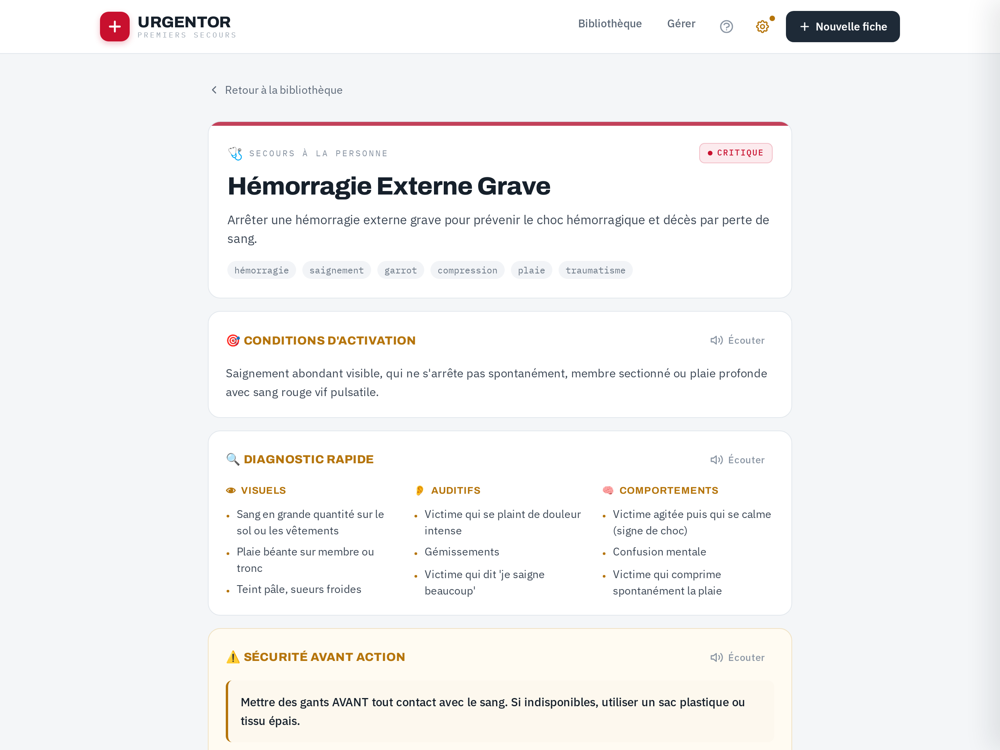
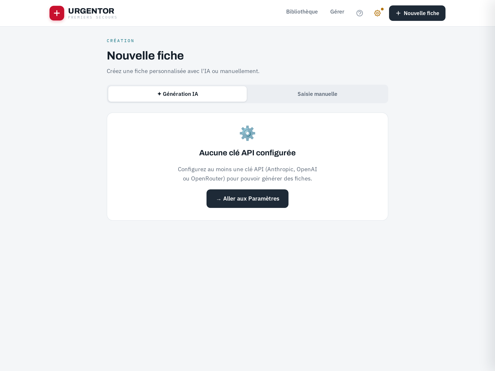
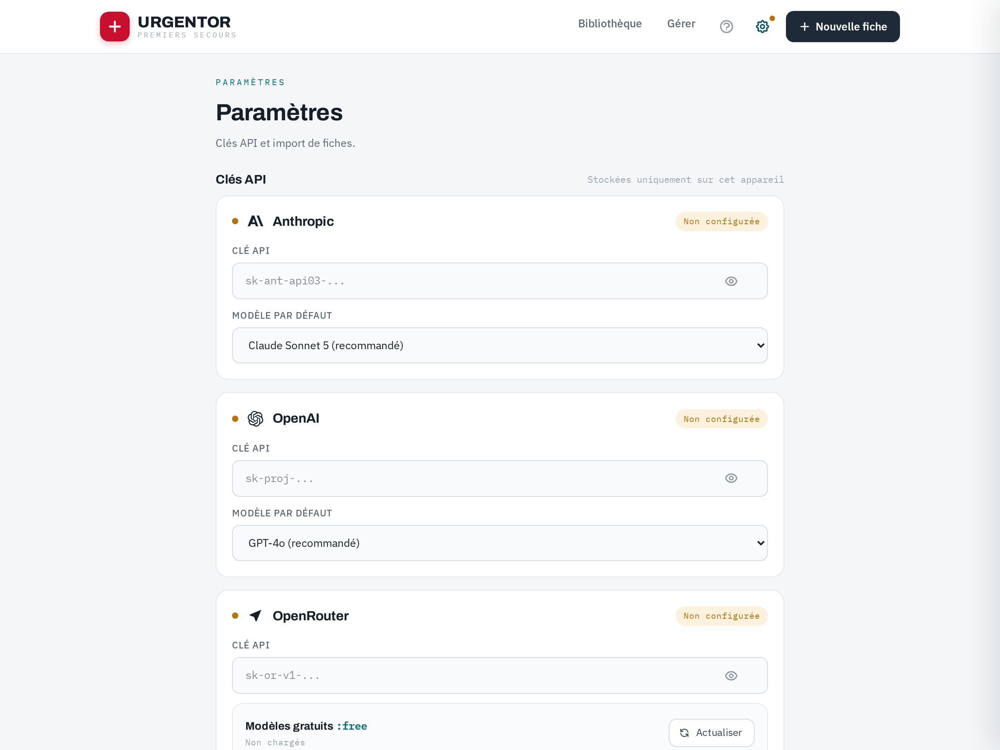

# 🚨 URGENTOR — Fiches de Premiers Secours

> Application web progressive (PWA) de référence pour les premières interventions d'urgence — **utilisable hors ligne**, sur mobile comme sur desktop.

---

## 📸 Aperçu

| Bibliothèque | Fiche détaillée |
|:---:|:---:|
|  |  |
| **Bibliothèque** — recherche accent-insensible et filtres par catégorie | **Fiche détaillée** — sections structurées avec lecture vocale |

| Génération de fiches par IA | Paramètres & import |
|:---:|:---:|
|  |  |
| **Nouvelle fiche** — génération IA ou saisie manuelle | **Paramètres** — clés API (Anthropic / OpenAI / OpenRouter) et import JSON |

| Gestion des fiches | Vue mobile |
|:---:|:---:|
|  |  |
| **Gestion** — import / export / suppression des fiches | **Mobile** — interface responsive et installable (PWA) |

---

## 🎯 À quoi ça sert ?

**Urgentor** centralise des fiches opérationnelles de premiers secours, structurées et claires, pour intervenir rapidement et efficacement face à une situation d'urgence — même sans connexion internet.

Chaque fiche couvre :
- ✅ Les **actions immédiates** (dans les 30 premières secondes)
- 📋 La **procédure pas à pas** numérotée
- 📞 Le **script d'alerte** (quoi dire au 15 / 18 / 112)
- 🌳 Les **arbres de décision** (« Si… alors… »)
- ⚠️ Les **signes d'aggravation** à surveiller
- ⏳ La section **« Si les secours tardent »** — que faire si l'aide professionnelle met du temps à arriver
- 🔴 Les **notes critiques** et contre-indications

---

## 📂 Catégories de fiches

| Icône | Catégorie | Contenu |
|-------|-----------|---------|
| 🩺 | **Secours à la personne** | Malaise cardiaque, hémorragie, brûlure, noyade |
| 🔥 | **Incendie & Évacuation** | Conduite à tenir en cas d'incendie, procédure d'évacuation |
| ☣️ | **Risque chimique** | Fuite de gaz, déversement chimique |
| ☢️ | **NRBC** | Alerte radiologique, alerte chimique NRBC |
| 🌍 | **Environnement & Extérieur** | Morsures, hypothermie, avalanche, foudre, naufrage |
| 🏭 | **Professionnel / Industriel** | Accidents du travail, écrasements, chutes, électrisation |
| 👥 | **Événementiel / Foule** | Mouvement de foule, bousculade, malaise de masse |
| 👶 | **Pédiatrie Spécifique** | Réanimation nourrisson, étouffement enfant, convulsions |
| 🤯 | **Psychologique / Comportemental** | État de choc, crise de panique, comportement agressif |

---

## ✨ Fonctionnalités

### 🔍 Recherche intelligente avec autocomplétion
- Recherche **sans accents** : tapez `brulure`, `hemorragie`, `nrbc`… sans vous soucier des accents
- **Autocomplétion** : suggestions dès 2 caractères, max 5 résultats triés par pertinence
- Navigation clavier (↑↓ Entrée Échap) et **tap direct** sur une suggestion pour ouvrir la fiche
- Mise en évidence de la correspondance dans le titre

### 🔊 Lecture vocale par section
- Chaque section d'une fiche dispose d'un **bouton haut-parleur** pour écoute mains libres
- Lecture en français (voix `fr-FR` si disponible)
- Compatible **iOS** (Safari) et **Android** (Chrome) — contournement du bug de pause WebView
- Une seule section parle à la fois — tap à nouveau pour stopper

### 📖 Bibliothèque de fiches
- **57 fiches officielles** pré-chargées, validées sur références HAS / INRS / Ministère de l'Intérieur
- Filtrage par catégorie avec les 9 couleurs de danger
- Affichage adapté aux situations NRBC (bandeau clignotant, code couleur critique)

### 🤖 Génération de fiches par IA
- Génération automatique de nouvelles fiches à partir d'un titre et d'une catégorie
- Compatible **Anthropic Claude** (Opus 4.8, Sonnet 5, Haiku 4.5), **OpenAI GPT** (GPT-4o, o3-mini), **OpenRouter** (modèles dynamiques)
- Prévisualisation avant sauvegarde

### 📥 Import / Export de fiches
- **Import JSON** dans Paramètres : glisser-déposer ou sélection de fichier
- Accepte un tableau de fiches ou une fiche unique
- Dédoublonnage automatique par identifiant
- **Export** de fiches personnalisées (fiche par fiche ou en lot)
- Workflow desktop → mobile : créez sur desktop, exportez en JSON, importez sur mobile

### 📝 Notes personnelles
- Zone de notes libre par fiche, sauvegardée localement
- Auto-save avec debounce (600 ms)

### ⚙️ Gestion des fiches
- Créer des fiches personnalisées (manuellement ou via IA)
- Modifier les fiches custom via éditeur JSON intégré (validation temps réel)
- Protection des fiches officielles — fork en un clic
- Suppression avec confirmation

### ❓ Aide contextuelle
- Bouton **`?`** dans la navbar, à côté de la roue paramètres
- Contenu adapté à la page courante : bibliothèque, fiche, paramètres, nouvelle fiche, gestion
- Panneau slide-in avec fermeture par tap, clic extérieur ou touche Échap

### 📴 Mode hors ligne (PWA)
- Installation sur l'écran d'accueil (iOS / Android / Desktop)
- Cache service worker — toutes les fiches disponibles sans réseau
- Polices Google Fonts mises en cache (StaleWhileRevalidate / CacheFirst)
- Données stockées dans le navigateur (localStorage)

---

## 🏗️ Stack technique

| Couche | Technologie |
|--------|-------------|
| Framework | **React 19** |
| Build | **Vite 8** |
| Styles | **Tailwind CSS v4** (`@tailwindcss/vite`) |
| Routing | **React Router v7** |
| PWA | **vite-plugin-pwa v1.2** (Workbox, generateSW) |
| TTS | **Web Speech API** (`speechSynthesis`) |
| Typo | Oswald · IBM Plex Sans · IBM Plex Mono |
| Stockage | `localStorage` (fiches, notes, paramètres) |
| Déploiement | **Netlify** (`netlify.toml`, SPA redirects, headers sécurité) |

---

## 🚀 Démarrage rapide

```bash
# Cloner le dépôt
git clone https://github.com/nouhailler/urgentor.git
cd urgentor

# Installer les dépendances
npm install --legacy-peer-deps

# Lancer en développement
npm run dev

# Build de production
npm run build

# Prévisualiser le build
npm run preview
```

---

## 🔑 Configuration des clés API *(optionnel)*

Pour utiliser la génération de fiches par IA, configurez vos clés dans **Paramètres** (icône ⚙️ dans la navbar) :

| Fournisseur | Modèles disponibles | Format de clé |
|-------------|---------------------|---------------|
| 🟣 **Anthropic** | Claude Opus 4.8, Sonnet 5, Haiku 4.5 | `sk-ant-...` |
| 🟢 **OpenAI** | GPT-4o, GPT-4o Mini, o3-mini | `sk-proj-...` |
| 🔵 **OpenRouter** | Tous les modèles (liste dynamique) | `sk-or-...` |

> Les clés sont stockées **uniquement dans votre navigateur** (localStorage), jamais transmises à un serveur tiers.

---

## 📁 Structure du projet

```
urgentor/
├── public/                    # Icônes PWA (SVG, PNG 192/512, Apple Touch)
├── src/
│   ├── components/
│   │   ├── Navbar.jsx         # Barre de navigation sticky + bouton aide
│   │   ├── HelpPanel.jsx      # Panneau d'aide contextuel (slide-in)
│   │   ├── SearchBar.jsx      # Recherche accent-insensible + autocomplétion
│   │   ├── FicheCard.jsx      # Carte résumé d'une fiche
│   │   ├── FicheDetail.jsx    # Vue complète avec lecture vocale par section
│   │   ├── SpeakButton.jsx    # Bouton haut-parleur animé (TTS)
│   │   ├── AIGenerator.jsx    # Générateur IA de fiches
│   │   ├── NRBCBadge.jsx      # Badge danger NRBC
│   │   └── DiagramVisuel.jsx  # Arbre de décision visuel
│   ├── pages/
│   │   ├── Home.jsx           # Bibliothèque + recherche + filtres
│   │   ├── FichePage.jsx      # Affichage d'une fiche
│   │   ├── NewFiche.jsx       # Création de fiche (manuel / IA)
│   │   ├── GestionFiches.jsx  # Import / export / suppression
│   │   ├── EditFiche.jsx      # Éditeur JSON intégré
│   │   └── Settings.jsx       # Paramètres clés API + import de fiches
│   ├── hooks/
│   │   ├── useFiches.js       # CRUD fiches + filtrage + import/export
│   │   ├── useSpeech.js       # TTS : voix FR, Android async, iOS keepalive
│   │   ├── useNotes.js        # Notes par fiche (localStorage)
│   │   ├── useSettings.js     # Gestion clés API et modèles IA
│   │   └── useOpenRouterModels.js  # Modèles OpenRouter dynamiques
│   └── data/
│       ├── categories.js           # 9 catégories avec couleurs et icônes
│       ├── ficheIndex.js           # Index des 57 fiches builtin
│       └── fiches/                    # 9 dossiers, un par catégorie
│           ├── secours-personne/      # malaise, hémorragie, brûlure, noyade…
│           ├── incendie-evacuation/   # incendie, évacuation
│           ├── chimique/              # fuite-gaz, déversement-chimique
│           ├── nrbc/                  # alerte-radiologique, alerte-chimique-nrbc
│           ├── environnement-exterieur/ # hypothermie, avalanche, foudre…
│           ├── professionnel-industriel/ # écrasement, chute, électrisation…
│           ├── evenementiel-foule/    # mouvement de foule, bousculade…
│           ├── pediatrie/             # réanimation nourrisson, convulsions…
│           └── psychologique/         # état de choc, crise de panique…
├── CONTEXT.md                 # Documentation technique interne du projet
├── netlify.toml               # Config Netlify (build, redirects, headers)
├── vite.config.js             # Config Vite + PWA Workbox
└── package.json
```

---

## 🗂️ Format d'une fiche JSON

Chaque fiche est un fichier `.json` (ou un objet dans un tableau exporté). Structure minimale :

```json
{
  "id": "slug-unique",
  "titre": "Hémorragie externe grave",
  "categorie": "secours-personne",
  "tags": ["saignement", "compression", "garrot"],
  "niveauDanger": "critique",
  "source": "officielle",
  "objectif": "Contrôler le saignement et maintenir en vie jusqu'aux secours",
  "actionsImmédiates": ["Comprimer immédiatement", "Appeler le 15"],
  "procedureAction": [{ "etape": 1, "action": "..." }],
  "scriptAlerte": { "numero": "15", "quoiDire": "..." },
  "arbresDecision": [{ "condition": "Saignement abondant", "alors": "Garrot" }],
  "siSecoursTardent": {
    "contexte": "Si les secours sont à plus de 20 min",
    "actions": ["Maintenir la compression"],
    "signesAggravation": ["Pâleur", "Confusion"],
    "limitesSansSecours": "Choc hémorragique sans transfusion = risque vital"
  },
  "notesCritiques": ["Ne jamais retirer un objet empalé"],
  "avertissement": "Information indicative uniquement"
}
```

Les fiches peuvent également inclure des champs `nrbc`, `chimique`, `diagnosticRapide`, `securiteAvantAction`, `zonesIntervention`, `decontamination` — voir `CONTEXT.md` pour le schéma complet.

---

## ⚠️ Avertissement légal

> Les informations contenues dans cette application sont **indicatives** et à but éducatif uniquement. Elles ne remplacent pas une formation certifiée aux premiers secours (PSC1, PSE1, AFGSU, etc.) ni l'avis d'un professionnel de santé.
>
> **En cas d'urgence, appelez toujours le 15 (SAMU), le 18 (Pompiers) ou le 112 (Numéro européen d'urgence).**

---

## 📄 Licence

Projet personnel — usage libre à des fins éducatives et non commerciales.

---

<div align="center">
  <strong>🚨 URGENTOR</strong> — Chaque seconde compte.<br/>
  Fait avec ❤️ pour que vous soyez prêts quand ça compte vraiment.
</div>
